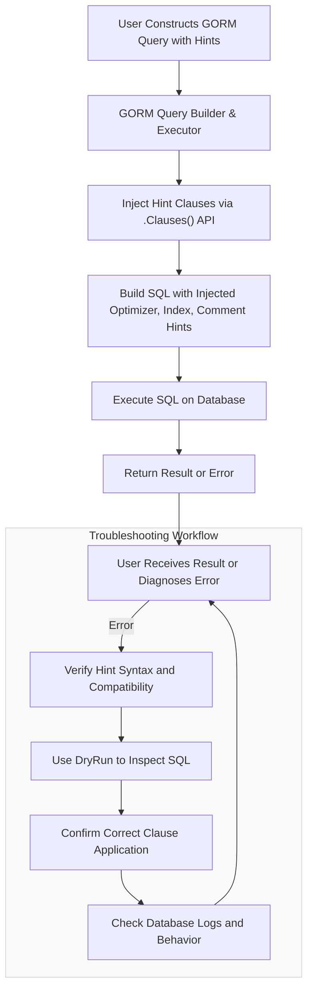

# Error Handling & Best Practices

GORM Hints empower you to inject optimizer, index, and comment hints into your SQL queries to boost performance and control execution plans. However, working with hints requires attention to error handling and best practices to ensure your application remains stable, maintainable, and efficient in production environments.

This guide helps you troubleshoot common issues you might encounter when applying hints, interpret error messages returned from GORM or the underlying database, and adopt maintainable, safe usage patterns for hints.

---

## Understanding the Error Landscape

When integrating hints with GORM queries, errors typically originate from one of three areas:

- **Syntax or semantic errors in the hint content itself**
- **Conflicts between applied hints and the actual SQL or database engine capabilities**
- **Misuse or incorrect positioning of hints within clauses via GORM’s Clauses API**

Proper diagnosis requires understanding the source context of errors and adopting debugging best practices.

### Common Error Types and Their Causes

| Error Type               | Cause                                                                                 | How to Identify                                   |
|--------------------------|---------------------------------------------------------------------------------------|--------------------------------------------------|
| SQL Syntax Errors        | Malformed hint strings or unsupported SQL hint syntax                                | Database returns syntax error when executing SQL |
| Invalid Clause Usage     | Applying hints on clauses where they aren’t permitted or supported                   | Unexpected GORM errors or hints not appearing    |
| Hint Conflicts           | Multiple contradictory hints or applying hints incompatible with query shape          | Database optimizer warnings or unexpected results|
| GORM Statement Errors    | Improper chaining or clause order causing GORM statement build failures              | GORM panics or error returns                      |

---

## Step-by-Step Troubleshooting Workflow

Follow these systematic steps when you face issues with hint application:

### 1. Verify Hint Content Syntax

- Review your hint strings for proper SQL hint syntax.
- Use the `DryRun` mode to inspect generated SQL to confirm hints are formatted correctly.
- For example:

```go
// Enable DryRun mode
db := DB.Session(&gorm.Session{DryRun: true})

// Build query with hint
result := db.Clauses(hints.New("MAX_EXECUTION_TIME(100) USE_INDEX(t1, idx1)")).Find(&User{})

fmt.Println(result.Statement.SQL.String())
// Output: SELECT /*+ MAX_EXECUTION_TIME(100) USE_INDEX(t1, idx1) */ * FROM `users`
```

If the SQL output is malformed or the hint string incorrect, adjust accordingly.

### 2. Confirm Appropriate Clause Application

Hints must be applied to clauses where they logically belong:

- Optimizer hints (`hints.New()`) target the `SELECT` or `UPDATE` clauses by default.
- Index hints (`UseIndex`, `ForceIndex`, `IgnoreIndex`) modify the `FROM` or `UPDATE` clauses.
- Comment hints (`Comment`, `CommentBefore`, `CommentAfter`) can be applied to specific clauses like `select`, `insert`, or `where`.

Misplacement can cause hints to be ignored or trigger errors.

Use `DryRun` or examine the resulting SQL to verify placement.

### 3. Check for Conflicting or Redundant Hints

- Avoid applying contradictory hints, such as forcing and ignoring the same index simultaneously.
- When chaining multiple hints, ensure their combined semantics make sense.
- Use explicit chaining methods from the API:

```go
DB.Clauses(
  hints.ForceIndex("idx_user_name").ForJoin(),
  hints.IgnoreIndex("idx_user_name").ForGroupBy(),
).Find(&User{})
```

This prevents conflicts and ensures clarity.

### 4. Review Database Engine Support and Behavior

- Different databases have varying support for optimizer and index hints; some hints might be unsupported or behave differently.
- Consult your database's documentation to confirm compatibility.
- Errors returned by the database often include details indicating unsupported hints.

### 5. Handle GORM Execution Errors

- Review error messages from GORM calls to determine if the issue stems from query building or execution.
- Common causes include invalid clause chains or improper use of `.Clauses()`.
- Use simple reproducible tests to isolate errors.

---

## Best Practices for Maintainable and Safe Hint Usage

### Apply Hints Judiciously

- Use hints only when profiling or execution plans strongly indicate benefits.
- Avoid scattering hints everywhere; focus on critical queries or hotspots.

### Prefer Readable and Explicit API Usage

- Use specific functions (`UseIndex`, `ForceIndex`, `Comment`) instead of raw hint strings when possible.
- Chain hints clearly to express intent.

Example:

```go
DB.Clauses(
  hints.New("MAX_EXECUTION_TIME(100)"),
  hints.UseIndex("idx_user_name"),
).Find(&User{})
```

### Validate in Development Before Production

- Test all hint applications in `DryRun` mode.
- Inspect generated SQL and execution plans.
- Gradually roll out hint changes in production.

### Employ Clear Comment Hints for Traceability

- Use comment hints to mark queries for easier identification and troubleshooting in logs or SQL monitoring.

```go
DB.Clauses(hints.Comment("select", "node1: important query")).Find(&User{})
```

### Monitor and Log SQL and Database Feedback

- Continuously monitor query performance and error logs.
- Detect regressions from hint application early.

### Avoid Overlapping or Nested Hint Application

- Keep hint application scope and combination manageable.
- Avoid combining conflicting index hints.

---

## Troubleshooting Reference

### Error: Hints Not Appearing in Generated SQL

- Confirm package is imported and `.Clauses()` used correctly.
- Use `DryRun` to inspect SQL.
- Check that the hint and clause names match supported positions.

### Error: Database Rejects Hint Syntax

- Double-check hint content syntax.
- Verify database supports that hint type.
- Adjust or remove problematic hints.

### Error: GORM Panics or Returns Unexpected Errors

- Validate syntax of chained clauses.
- Confirm no duplication of identical clauses.
- Simplify queries to isolate fail points.

---

## Practical Example: Handling an Index Hint Error

Suppose you try forcing an index but see an error:

```go
result := DB.Clauses(hints.ForceIndex("idx_missing")).Find(&User{})
if result.Error != nil {
  fmt.Println("Error applying index hint:", result.Error)
}
```

### Recommended Steps:

1. Verify `idx_missing` exists in the database schema.
2. Use `DryRun` mode to check SQL:

   ```go
   db := DB.Session(&gorm.Session{DryRun: true})
   sql := db.Clauses(hints.ForceIndex("idx_missing")).Find(&User{}).Statement.SQL.String()
   fmt.Println(sql)
   ```

3. If SQL is correct, check whether the database supports the index hint on this table or query.
4. If the error persists, try removing or replacing the hint for stability.

---

## Summary

Handling errors and applying best practices ensures your use of GORM Hints remains effective and sustainable in production. Adopt iterative testing with DryRun, apply hints clearly and explicitly, watch for conflicts, and maintain monitoring to balance optimization benefits against stability.

For deeper insights and examples, visit the related documentation sections.

---

## Related Resources

- [Core Hint Clauses: Optimizer Hints](/api-reference/core-hint-clauses/optimizer-hints) — Learn how to apply optimizer hints clearly
- [Core Hint Clauses: Index Hints](/api-reference/core-hint-clauses/index-hints) — Detailed API and usage patterns for index hints
- [Core Hint Clauses: Comment Hints](/api-reference/core-hint-clauses/comment-hints) — Techniques for annotating queries
- [Chaining and Combining Hints](/api-reference/advanced-usage-and-integration/chaining-and-combining-hints) — Advanced hint composition
- [Getting Started Setup & Installation](/getting-started/setup-installation/prerequisites) — Ensure proper environment setup
- [First Steps Troubleshooting](/getting-started/first-steps/troubleshooting) — Common issues during initial usage

---

## Visual Overview of Hint Processing Flow



---

Continue your journey by applying these troubleshooting steps and best practices to harness the full power of hints safely and maintainably within your GORM-powered applications.