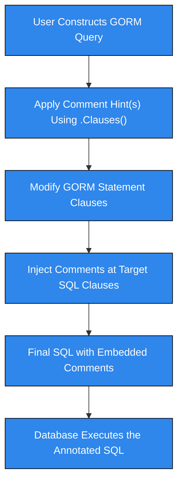

# Comment Hints

## Overview

Comment Hints provide a powerful way to insert SQL comments at specific positions within your queries generated by GORM. These comments are invaluable for influencing database proxies, implementing sharding rules, annotating queries for telemetry, or embedding custom hints that certain database engines or middleware recognize.

This page explains how to use the `Comment`, `CommentBefore`, and `CommentAfter` APIs in the GORM Hints extension to seamlessly integrate custom SQL comments. You'll learn how to position comments relative to different SQL clauses and combine them with other hint types for precise control over your queries.

---

## How Comment Hints Work

The GORM Hints extension leverages GORM's clause system to inject comments at distinct locations within SQL statements. Each comment hint targets one or more SQL clauses (e.g., `SELECT`, `INSERT`, `WHERE`) and specifies where the comment should appear:

- **Inline after the clause keyword** (default for `Comment`), e.g., `SELECT /* comment */ * FROM ...`
- **Before the clause**, e.g., `/* comment */ SELECT * FROM ...`
- **After the clause content**, e.g., `SELECT * /* comment */ FROM ...`

These options allow for flexible annotation to satisfy use cases like database proxy routing, query tagging for monitoring, or influencing database execution plans.


## Core APIs for Comment Hints

| Function                 | Description                                                  | Position       | Usage Example                                  |
|--------------------------|--------------------------------------------------------------|----------------|-----------------------------------------------|
| `Comment(clause, comment)`       | Inserts a comment immediately following the named clause keyword | Inline after   | `SELECT /* hint */ * FROM users`               |
| `CommentBefore(clause, comment)` | Inserts a comment before the named clause keyword             | Before         | `/* hint */ SELECT * FROM users`                |
| `CommentAfter(clause, comment)`  | Inserts a comment after the clause content                     | After          | `SELECT * /* hint */ FROM users`                 |


## Using Comment Hints in Practice

The following examples illustrate how to add comments to queries using the different comment APIs.

### 1. Inline Comment After Clause Keyword

Use `Comment` to place a comment inside `/* ... */` immediately following the specified clause keyword.

```go
import "gorm.io/hints"

result := DB.Clauses(hints.Comment("select", "master")).Find(&User{})
// Resulting SQL:
// SELECT /* master */ * FROM `users`
```

### 2. Comment Before Clause Keyword

Insert comments just before a clause keyword to embed tags that must precede SQL commands.

```go
result := DB.Clauses(hints.CommentBefore("select", "node2")).Find(&User{})
// Resulting SQL:
// /* node2 */ SELECT * FROM `users`
```

### 3. Comment After Clause Content

Add comments after the content of a clause, commonly used for `WHERE` clauses.

```go
result := DB.Clauses(hints.CommentAfter("where", "hint")).Find(&User{}, "id = ?", 1)
// Resulting SQL:
// SELECT * FROM `users` WHERE id = ? /* hint */
```

### 4. Combining Multiple Comments

Multiple comment hints on the same clause are merged with spaces between comments.

```go
result := DB.Clauses(
  hints.Comment("select", "hint1"),
  hints.CommentAfter("select", "hint2"),
  hints.CommentBefore("select", "hint3"),
).Find(&User{})
// Resulting SQL:
// /* hint3 */ SELECT /* hint1 */ * /* hint2 */ FROM `users`
```

---

## Integration Points with GORM

- **Clauses API**: Comment hints are injected using GORM's `.Clauses()` method, making them composable with other clauses like `Where`, `Joins`, or index hints.
- **Target Clause**: You specify the SQL clause as a string in the APIs (`select`, `insert`, `update`, `where`, etc.) to control precisely where the comment appears.
- **DryRun Compatibility**: Comment insertion supports GORM's DryRun mode, enabling verification of generated SQL before execution.

<Info>
For best results, ensure the clause name matches GORM's recognized clause identifiers (e.g., `select`, `insert`, `update`, `where`). Incorrect or unsupported clause names will result in comments not being applied.
</Info>

---

## Practical Scenarios for Comment Hints

- **Database Proxy Control:** Insert shard identifiers or routing hints before queries to route traffic to appropriate data nodes.

- **Query Annotation:** Embed metadata or user/session info for query auditing and tracing.

- **Custom Query Optimization:** Complement optimizer and index hints with comments recognized by specific database engines or middleware.

- **Debugging and Monitoring:** Mark queries explicitly within logs by inserting traceable comments.

---

## Best Practices

- Use clause-specific comment APIs (`Comment`, `CommentBefore`, `CommentAfter`) according to where the database or proxy expects hints.
- Combine comment hints with index and optimizer hints for maximum influence on query execution.
- Test generated SQL with DryRun mode to validate comment placement.
- Avoid overloading comments with excessive data to minimize performance impacts.

---

## Troubleshooting Common Issues

### Comments Not Appearing?
- Verify the clause string passed to the comment API matches the GORM clause keyword exactly.
- Confirm no other clauses or middleware strip out comments.
- Use DryRun mode to inspect raw generated SQL.

### Comments in Wrong Position?
- Switch between `Comment`, `CommentBefore`, and `CommentAfter` to find the appropriate injection point.
- Review DB proxy or engine documentation for required comment location.

### Combining with Other Hints
- Comments can coexist with optimizer and index hints by applying multiple `.Clauses()` calls.
- Order of chained `.Clauses()` calls affects merge order; plan carefully.

---

## Complete Example

```go
package main

import (
	"gorm.io/driver/sqlite"
	"gorm.io/gorm"
	"gorm.io/hints"
	"log"
)

type User struct {
	ID   uint
	Name string
}

func main() {
	db, err := gorm.Open(sqlite.Open(":memory:"), &gorm.Config{DryRun: true})
	if err != nil {
		log.Fatal(err)
	}

	// Insert comment before SELECT clause
	result := db.Clauses(hints.CommentBefore("select", "shard=2")).Find(&User{})
	// Generated SQL:
	// /* shard=2 */ SELECT * FROM `users`

	// Inline comment after SELECT keyword
	result = db.Clauses(hints.Comment("select", "optimizer_hint")).Find(&User{})
	// Generated SQL:
	// SELECT /* optimizer_hint */ * FROM `users`

	// Comment after WHERE clause content
	result = db.Clauses(hints.CommentAfter("where", "filter_applied")).Find(&User{}, "id = ?", 1)
	// Generated SQL:
	// SELECT * FROM `users` WHERE id = ? /* filter_applied */

	log.Println("Final SQL:", result.Statement.SQL.String())
}
```

---

## Related Documentation

- [Optimizer Hints](/api-reference/core-hint-clauses/optimizer-hints): Inject SQL optimizer hints for execution plan tuning.
- [Index Hints](/api-reference/core-hint-clauses/index-hints): Control index usage with `USE INDEX`, `FORCE INDEX`, and `IGNORE INDEX`.
- [Chaining and Combining Hints](/api-reference/advanced-usage-and-integration/chaining-and-combining-hints): Techniques to combine hints effectively.
- [Getting Started Guides](/getting-started/setup-installation/installing-package) for installation and configuration.

---

## Visual Flow of Comment Hint Injection



This flow illustrates how comment hints are integrated into the SQL generation lifecycle, empowering you to influence SQL statements precisely where needed.

---

With these APIs and guidance, you can effectively leverage comment hints in GORM to enhance query control, traceability, and performance tuning across diverse database infrastructures.


---

<section style="font-size: 0.9em; color: #666; margin-top: 3rem;">
  Document based on GORM Hints v1.0. For source references, visit the <a href="https://github.com/go-gorm/hints">GORM Hints GitHub repository</a>.
</section>
