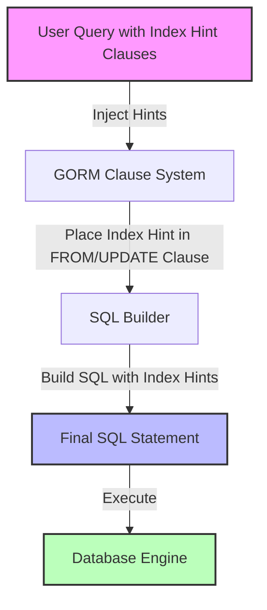

# Index Hints API Reference

This documentation provides a comprehensive guide to using **Index Hints** in the GORM Hints extension. These hints—`UseIndex`, `ForceIndex`, and `IgnoreIndex`—allow you to explicitly control which indexes the SQL query optimizer should prefer, avoid, or mandate for specific query operations. By targeting indexes precisely and applying hints selectively (e.g., for JOIN, GROUP BY, ORDER BY), you can fine-tune query execution plans to optimize performance in complex scenarios.

---

## 1. Introduction to Index Hints

Index hints instruct the database query planner on how to utilize indexes associated with the target tables during query execution. Unlike general optimizer hints, index hints focus exclusively on influencing index selection and usage.

With GORM Hints, you can:

- Select one or more indexes to **use** explicitly with `UseIndex`.
- Force the use of one or more indexes with `ForceIndex`.
- Ignore one or more indexes with `IgnoreIndex`.
- Specify the scope of these hints—for example, only apply for JOIN operations, ORDER BY clauses, or GROUP BY clauses.
- Chain multiple hints together seamlessly to create sophisticated query directives.

This API provides intuitive methods that integrate naturally with GORM clauses, enabling you to apply index hints declaratively and in a flexible manner.

## 2. Core Index Hint Functions and Usage

### Index Hint Types

- `UseIndex(names ...string) IndexHint`
- `ForceIndex(names ...string) IndexHint`
- `IgnoreIndex(names ...string) IndexHint`

Each function accepts one or more index names as strings and returns an `IndexHint` instance.

### Specifying Hint Scope

You can further refine where the index hint applies by chaining one of these methods:

- `.ForJoin()` — Apply the index hint only for JOIN operations.
- `.ForOrderBy()` — Apply the index hint only for ORDER BY clauses.
- `.ForGroupBy()` — Apply the index hint only for GROUP BY clauses.

```go
// Example: Force use of specific indexes for JOIN
hint := hints.ForceIndex("idx_user_name", "idx_user_id").ForJoin()
```

### Applying Hints in GORM Queries

Add index hints as clauses to your queries:

```go
DB.Clauses(hints.UseIndex("idx_user_name")).Find(&User{})
// Generated SQL:
// SELECT * FROM `users` USE INDEX (`idx_user_name`)

DB.Clauses(
  hints.ForceIndex("idx_user_name", "idx_user_id").ForJoin(),
  hints.IgnoreIndex("idx_user_name").ForGroupBy(),
).Find(&User{})
// Generated SQL:
// SELECT * FROM `users` FORCE INDEX FOR JOIN (`idx_user_name`,`idx_user_id`) IGNORE INDEX FOR GROUP BY (`idx_user_name`)
```

## 3. Detailed API Reference

### `UseIndex(names ...string) IndexHint`
**Description:** Suggests the query optimizer to use the specified indexes if possible.

**Parameters:**
- `names` (variadic string): One or more index names.

**Returns:**
- `IndexHint` instance.

### `ForceIndex(names ...string) IndexHint`
**Description:** Forces the query optimizer to use the specified indexes.

**Parameters:**
- `names` (variadic string): Index names to enforce.

**Returns:**
- `IndexHint` instance.

### `IgnoreIndex(names ...string) IndexHint`
**Description:** Instructs the query optimizer to ignore the specified indexes during query planning.

**Parameters:**
- `names` (variadic string): Index names to exclude.

**Returns:**
- `IndexHint` instance.

### Scope Methods

These chainable methods specify on which part of the SQL statement the index hint applies.

- `.ForJoin() IndexHint`
- `.ForOrderBy() IndexHint`
- `.ForGroupBy() IndexHint`

**Usage:**

```go
hints.ForceIndex("idx1").ForJoin()
hints.IgnoreIndex("idx2").ForOrderBy()
```

### How These Hints Integrate with SQL

Index hint clauses are injected directly into the `FROM` (or `UPDATE`) part of the SQL query to influence index usage in the most relevant context.

Example of generated SQL:

```sql
SELECT * FROM `users` USE INDEX (`idx_name`) WHERE `status` = 'active';
```

## 4. Combining Multiple Index Hints

The API supports chaining multiple index hints to cover complex query operations requiring fine-grained control.

```go
DB.Clauses(
  hints.ForceIndex("idx_user_name").ForOrderBy(),
  hints.IgnoreIndex("idx_user_name").ForGroupBy(),
).Find(&User{})
```

This generates SQL that applies different index hints selectively.

## 5. Practical Examples

### Example 1: Use Specific Index

```go
DB.Clauses(hints.UseIndex("idx_email")).Find(&User{})
```
SQL Output:

```sql
SELECT * FROM `users` USE INDEX (`idx_email`)
```

### Example 2: Force Index Usage for JOIN

```go
DB.Clauses(hints.ForceIndex("idx_fk_user").ForJoin()).Joins("Profile").Find(&User{})
```
SQL Output:

```sql
SELECT `users`.* FROM `users` FORCE INDEX FOR JOIN (`idx_fk_user`) LEFT JOIN `profiles` ON `profiles`.`user_id` = `users`.`id`
```

### Example 3: Ignore Index for GROUP BY

```go
DB.Clauses(hints.IgnoreIndex("idx_status").ForGroupBy()).Group("status").Find(&User{})
```
SQL Output:

```sql
SELECT * FROM `users` IGNORE INDEX FOR GROUP BY (`idx_status`) GROUP BY `status`
```

### Example 4: Combining Multiple Hints

```go
DB.Clauses(
  hints.ForceIndex("idx1", "idx2").ForOrderBy(),
  hints.IgnoreIndex("idx3").ForGroupBy(),
).Find(&User{})
```
SQL Output:

```sql
SELECT * FROM `users` FORCE INDEX FOR ORDER BY (`idx1`,`idx2`) IGNORE INDEX FOR GROUP BY (`idx3`)
```

## 6. Best Practices

- **Specify explicit index names:** Use database query analysis tools to identify which indexes to hint.
- **Use scope methods to target hints:** Avoid forcing indexes globally unless necessary; specify `FOR JOIN`, `FOR ORDER BY`, or `FOR GROUP BY` to minimize negative side effects.
- **Combine hints carefully:** Test compound hints with `DryRun` mode to validate generated SQL and confirm index usage.
- **Avoid overusing `ForceIndex`:** Use it only when confident the optimizer’s automatic choice is suboptimal.

## 7. Common Pitfalls and Troubleshooting

- **Indexes do not exist:** Ensure the index names supplied exist in your database schema.
- **Hints ignored:** Some databases or DBMS versions do not honor index hints strictly—confirm your DBMS supports this feature.
- **Conflicting hints:** Avoid conflicting hints (e.g., forcing and ignoring the same index in the same query).
- **Unexpected query plans:** Use database explain plans to verify that the hints produce the desired effect.

Use GORM’s DryRun mode and logging to inspect generated SQL for troubleshooting.

## 8. Integration Details

Under the hood, index hints are injected as `AfterExpression` clauses into the `FROM` or `UPDATE` statements by the GORM clause system. The `IndexHintFromClauseBuilder` method handles correct placement of index hints between table names and any JOINs to ensure syntactically valid and effective SQL.

## 9. Example with Full Code

```go
package main

import (
	"fmt"
	"gorm.io/driver/mysql"
	"gorm.io/gorm"
	"gorm.io/hints"
)

type User struct {
	ID   uint
	Name string
}

func main() {
	dsn := "your-database-dsn"
	db, err := gorm.Open(mysql.Open(dsn), &gorm.Config{})
	if err != nil {
		panic(err)
	}

	var users []User

	// Use 'idx_name' index explicitly
	db.Clauses(hints.UseIndex("idx_name")).Find(&users)

	// Force index for JOIN
	db.Clauses(hints.ForceIndex("idx_fk_user").ForJoin()).Joins("Profile").Find(&users)

	// Ignore index for GROUP BY
	db.Clauses(hints.IgnoreIndex("idx_status").ForGroupBy()).Group("status").Find(&users)

	fmt.Println("Queries executed with index hints")
}
```

---

## See Also

- [Optimizer Hints API Reference](/api-reference/core-hint-clauses/optimizer-hints) — For influencing query execution beyond index control.
- [Chaining and Combining Hints](/api-reference/advanced-usage-and-integration/chaining-and-combining-hints) — Advanced usage scenarios.
- [Setup & Installation](/getting-started/setup-installation/prerequisites) — Installing and configuring GORM Hints.

---

## Diagram: Index Hint Integration Flow


This diagram highlights how index hints enter the query construction process within GORM, showing the injection during clause modification and eventual SQL generation.

---

## Troubleshooting

<AccordionGroup title="Common Problems with Index Hints">
<Accordion title="Index Hints Not Appearing in SQL">
- Ensure you have added the index hint as a `Clause` in your query.
- Verify that you are not overriding clauses that remove index hints.
- Confirm your DBMS supports index hints (some do not honor them).
</Accordion>
<Accordion title="Conflicting or Ignored Index Hints">
- Avoid applying contradictory hints simultaneously.
- Check your DBMS documentation if index hints can be ignored under some circumstances.
- Use `DryRun` mode to inspect generated SQL and confirm index hints.
</Accordion>
</AccordionGroup>

---

## Summary
GORM's Index Hint API empowers you to finely control index usage within your SQL queries via three core functions—`UseIndex`, `ForceIndex`, and `IgnoreIndex`. The ability to scope these hints to JOIN, ORDER BY, or GROUP BY operations, and to chain multiple index hints fluently, provides a robust toolset to tune query execution plans, especially in complex or performance-critical database interactions.

By following best practices and validating through tools such as query explain plans and `DryRun` mode, you can realize significant performance improvements and precise control over generated SQL behavior.